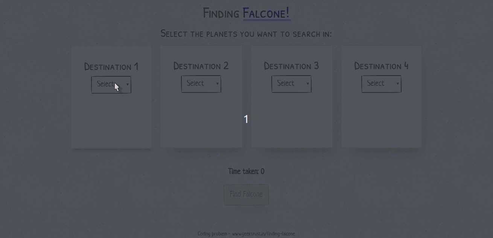

# Geektrust coding problem - Finding Falcone

- [Github](https://github.com/318097/finding-falcone "Repo Link")
- [Public URL](https://318097.github.io/finding-falcone/#/home "Public URL")

## Preview

## Available scripts

- `yarn start` - Start the application.

## Dependencies

- `react-router-dom` - Routing & Navigation.
- `papercss` - The default css styling and theme.
- `axios` - HTTP requests.
- `query-string` - Parsing & Creating query strings.
- `styled-components` - Custom styled wrappers.
- `node-sass` - App styling.
- `gh-pages` - Public deployment.

## Running the project

Navigate to the root of the project folder & run the following commands:

1. `yarn` - to install all the dependencies.
2. `yarn start` - to start the application.

---

This project was bootstrapped with [Create React App](https://github.com/facebook/create-react-app).
